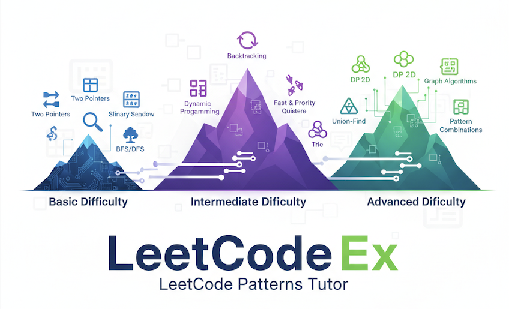

# LeetCode Patterns Tutor



A comprehensive platform for learning algorithmic patterns through interactive coding exercises.

## Features

- **Pattern-Based Learning**: Exercises focused on specific algorithmic patterns (Two Pointers, Hash Map, Sliding Window, etc.)
- **Interactive Editor**: Monaco-based code editor with syntax highlighting
- **Python Sandbox**: Safe Python code execution using isolated `uv` virtual environments
- **Progressive Hints**: Step-by-step hints to guide problem-solving
- **LLM-Generated Exercises**: AI-powered exercise generation with detailed explanations
- **Visualizations**: Interactive visualizations for algorithm behavior (available on exercise screen via "Visualize" button)

## Difficulty Levels & Expected Patterns

### Basic Difficulty (Tier 1)

Users should be able to solve problems using:
- **Two Pointers**: pair sum, palindromes, merging
- **Sliding Window**: substring constraints
- **Binary Search**: simple sorted array search
- **BFS/DFS**: tree traversals, simple graph connectivity

### Intermediate Difficulty (Tier 1 & 2)

Users should be able to solve problems using:
- **Backtracking**: subsets, permutations, combinations
- **Dynamic Programming**: 1D state, classic variants
- **Fast & Slow Pointers**: linked list cycles, middle element
- **Heap/Priority Queue**: top-K, stream problems
- **Union-Find**: basic connected components
- **Trie**: prefix search basics

### Advanced Difficulty (All patterns including combinations)

Users should be able to solve complex problems combining multiple patterns:
- **DP**: 2D state, complex state transitions
- **Union-Find**: advanced optimizations, dynamic connectivity
- **Trie**: complex prefix problems, multiple strings
- **Topological Sort / Cycle Detection**: DAG scheduling, course prerequisites
- **Graph algorithms**: shortest paths, MST, network flow basics
- **Pattern combinations**: e.g., DP + Heap, BFS + Bitmask

## LLM Configuration

Users can change their LLM settings on the Welcome Screen. Set environment variables in `.env` or use defaults:

```bash
VITE_LLM_API_BASE=http://to-your-api/v1
VITE_LLM_API_KEY=your-api-key
VITE_LLM_MODEL=your-model
```

## Requirements

- Node.js 18+
- Python 3.13+
- `uv` package manager (`pip install uv`)

## Installation

```bash
npm install
```

## Development

### Starting the Development Servers

The app requires two servers running simultaneously:

1. **Backend Python Sandbox Server** (port 3002)
2. **Vite Development Server** (port 3001, 3003, or available port)

#### Option 1: Start Both with One Command (Recommended)

```bash
npm start
```

This runs both servers concurrently using `concurrently`.

#### Option 2: Start Servers Separately

**Terminal 1 - Backend Server:**
```bash
npm run server
```

**Terminal 2 - Frontend:**
```bash
npm run dev
```

### How to Use

1. Start both servers as described above
2. Open your browser to the Vite server URL (typically `http://localhost:3003`)
3. Select a difficulty level
4. Solve the coding exercise
5. Click "Submit Solution" to test your code against 12 test cases
6. View detailed feedback on which test cases passed/failed
7. Click "Visualize" (top-right on Exercise Screen) to see step-by-step algorithm visualization

## Architecture

### Frontend
- **React** with TypeScript
- **Vite** as the build tool
- **Monaco Editor** for code editing
- **Tailwind CSS** for styling

### Backend
- **Node.js/Express** server
- **Python sandbox** using `uv venv` for isolated code execution
- **Pytest** for automated test case execution

### Python Sandbox Flow

1. Server initializes a persistent `uv` virtual environment
2. When user submits code:
   - Generate pytest tests from exercise examples (first 2 shown to user, all 12 used for testing)
   - Execute with `uv run pytest`
   - Parse results and return verdict
3. Sandbox environment is reused for performance


## Building for Production

```bash
npm run build
npm run preview
```

## Project Structure

```
src/
├── components/        # React components
├── hooks/            # Custom React hooks
├── modules/          # Business logic modules
│   ├── PythonSandbox.ts    # Client-side sandbox interface
│   ├── ExerciseGenerator.ts # LLM integration
│   └── LLMExerciseParser.ts # Response parsing
├── prompts/          # LLM prompt templates
├── types.ts          # TypeScript type definitions
└── main.tsx          # App entry point
server/
├── index.mjs         # Express server entry point
├── api/
│   └── sandbox.mjs   # Python sandbox API endpoints
```

## License

Appache Licence 2.0
